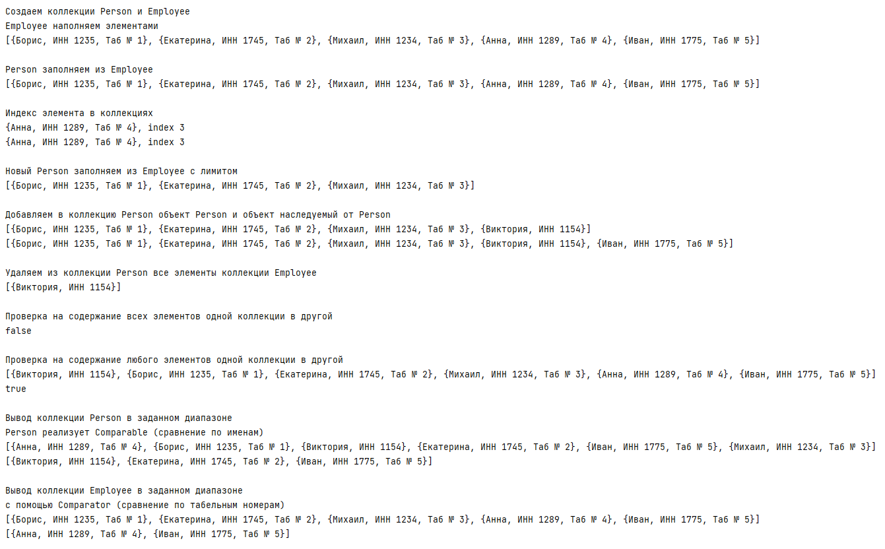

##Задача: Параметризовать методы, используя правило PECS, и реализовать их

Элементы модели представляют собой класс Person и наследуемый от него Employee.
Person реализует Comparable для выборки из диапазона (сравнение по полю name).
Для аналогичной задачи, но с компаратором объекты класса Employee сравниваются 
по табельным номерам

